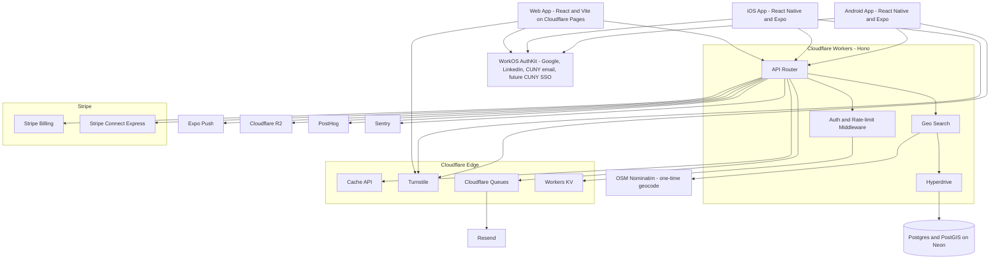
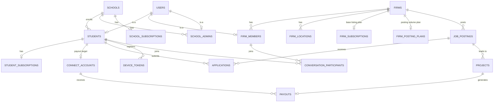
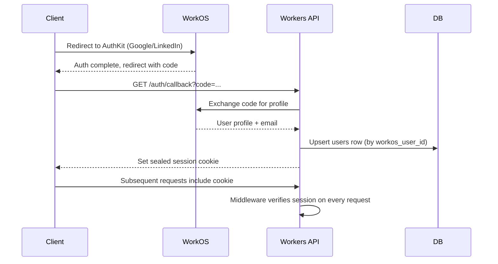
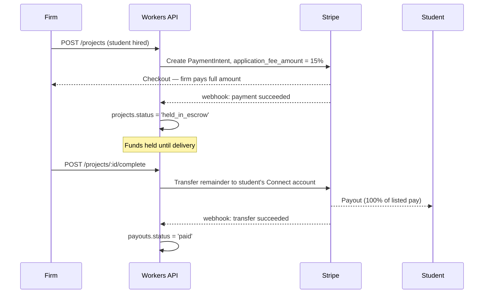

# Archly — Full-Stack Architecture (Web + Mobile)

> **This is the committed build plan**, not a menu of options — Cloudflare end-to-end, decided. Covers system design, every endpoint, hosting, and what actually gets built first. See [[archly]] for the company overview/business model and [[archly - todo and open questions]] for the original CUNY-auth research this still relies on. See [[#0. Scope — Architecture + Adjacent Majors]] for the resolved discipline taxonomy.

**pages in this folder:**
- [[archly]] — company overview + current frontend (React + Vite, already built)
- [[archly - todo and open questions]] — CUNY auth research, pilot program strategy
- [[archly system design]] — this page — the committed system design

---

## 0. Scope — Architecture + Adjacent Majors

Resolved: **architecture-only stays the rule**, matching [[archly#1. What Is Archly?]]'s explicit "students who already know your tools (Revit, Rhino, AutoCAD, etc.)" value proposition — this is *not* a pivot to general engineering. The scope is architecture plus the majors and firm types that sit directly around architectural practice, since those students share the same toolset and those firms hire alongside architects on the same projects:

- **Student disciplines:** Architecture (B.Arch/M.Arch), Architectural Technology, Interior Design, Urban Design/Planning, Landscape Architecture, Construction Management, Architectural Engineering (building systems/structural — the one "engineering" title that's genuinely architecture-adjacent, distinct from general Civil/Mechanical/Electrical engineering)
- **Firm types:** Architecture firms, interior design firms, landscape architecture firms, urban planning/design firms, construction management firms — i.e. the firms an architecture student would realistically apply to or collaborate with, not engineering firms broadly

`firms.industry_type`, `students.discipline`, and `job_postings.discipline` (below) all use this same taxonomy. No change needed to `archly.md` §1's "architecture-only" framing — this just makes explicit which adjacent majors/firms were always implied by "architecture" in practice, rather than expanding into unrelated engineering disciplines.

---

## 1. Decision Summary

- **Web frontend** — Keep the existing React 19 + Vite app. Do not rewrite to Next.js — 17 pages are already built and working; a rewrite buys nothing here since the app is auth-gated (dashboards, applications, messaging), not SEO-dependent public content. Deploy as-is to **Cloudflare Pages**.
- **Mobile** — **React Native + Expo**, one codebase for iOS/Android, distributed via **Expo EAS**.
- **Backend API** — **Cloudflare Workers**, using **Hono** as the routing/middleware framework (TypeScript-native, built for Workers, has first-class Zod validation middleware).
- **Database** — **Postgres + PostGIS on Neon**, single region (`us-east-1`), accessed from Workers via **Cloudflare Hyperdrive**.
- **ORM** — **Drizzle** (+ Drizzle Kit for migrations) — runs natively on the Workers runtime.
- **Auth** — **WorkOS AuthKit** — Google + LinkedIn OAuth now; CUNY domain-restricted email verification now (per [[archly - todo and open questions#2. Authentication — Google + CUNY Email]]); true CUNY SSO added later, once a formal CUNY partnership exists.
- **Payments** — **Stripe Billing** (subscriptions) + **Stripe Connect Express** (student payouts), escrow via `application_fee_amount` held until project completion.
- **Maps** — **Leaflet + OpenStreetMap on web** (already built, keep it), **native maps via `react-native-maps`** on mobile (Apple Maps on iOS, Google Maps free tier on Android — no Places/Geocoding API billing). Addresses are geocoded **once, at listing-creation time**, using free OpenStreetMap Nominatim, then stored as a PostGIS point — no per-search API costs at runtime.
- **File storage** — **Cloudflare R2** (resumes, portfolios, logos, project images).
- **Email** — **Resend**, sent via **Cloudflare Queues** (batched, not synchronous).
- **Push notifications** — **Expo Push Notifications**.
- **Caching** — **Cloudflare Cache API** (geo search results) + **Workers KV** (sessions, rate-limit counters).
- **Bot protection** — **Cloudflare Turnstile** on signup/waitlist/apply forms.
- **Analytics** — **PostHog** (product analytics) + **Cloudflare Web Analytics** (free, no-cookie pageview stats for marketing pages).
- **Error tracking** — **Sentry** (Workers + React + React Native all have first-party SDKs).
- **CI/deploy** — **Wrangler** + GitHub Actions, three environments: `dev` → `staging` → `production`.

This is the whole stack. No remaining "or" — every item above is what gets built.

---

## 2. System Design



**Core principle unchanged:** one Workers API, shared by web and both mobile platforms. No duplicated business logic between clients.

---

## 3. Monorepo Structure

```
archly/
├── apps/
│   ├── web/        React + Vite (existing app, moved into monorepo as-is)
│   ├── mobile/      React Native + Expo
│   └── api/         Cloudflare Workers (Hono)
├── packages/
│   ├── shared/      Zod schemas, TS types, API client (used by all three apps)
│   └── db/          Drizzle schema + migrations (imported by apps/api only)
├── turbo.json
└── package.json
```

Managed with **Turborepo**. `packages/shared`'s Zod schemas are the single source of truth for a data shape — a field added to `job_postings` updates the DB schema, the API's validation, and both clients' TypeScript types from one edit.

---

## 4. Database

Postgres + PostGIS on Neon, single region near NYC. Geo queries (`ST_DWithin`) run in the database, not client-side — this matters once the userbase is CUNY-wide rather than one program.



```sql
-- Identity
users (
  id UUID PK,
  email TEXT UNIQUE NOT NULL,
  role TEXT NOT NULL CHECK (role IN ('student','firm_member','school_admin','super_admin')),
  workos_user_id TEXT UNIQUE,
  created_at TIMESTAMPTZ DEFAULT now()
)

-- Schools (institutional side — matches the $5,000+/yr "Schools" tier)
schools (
  id UUID PK,
  name TEXT NOT NULL,
  cuny_campus_code TEXT,
  partner_status TEXT CHECK (partner_status IN ('trial','active','lapsed')),
  trial_ends_at TIMESTAMPTZ,   -- 6-month free trial
  created_at TIMESTAMPTZ DEFAULT now()
)

school_admins (
  user_id UUID PK REFERENCES users(id),
  school_id UUID REFERENCES schools(id),
  role TEXT DEFAULT 'admin'
)

school_subscriptions (
  id UUID PK,
  school_id UUID UNIQUE REFERENCES schools(id),
  stripe_subscription_id TEXT,   -- nullable — likely manually invoiced
  contract_value_cents INT NOT NULL,  -- min 500000 ($5,000)
  status TEXT CHECK (status IN ('trial','active','past_due','canceled')),
  renewal_date DATE
)

-- Students
students (
  user_id UUID PK REFERENCES users(id),
  school_id UUID REFERENCES schools(id),
  discipline TEXT NOT NULL,        -- 'architecture' | 'architectural_technology' | 'interior_design' | 'urban_design' | 'landscape_architecture' | 'construction_management' | 'architectural_engineering' — see §0
  major TEXT,
  graduation_date DATE NOT NULL,   -- access gate, independent of subscription status
  cuny_email_verified BOOLEAN DEFAULT false,
  created_at TIMESTAMPTZ DEFAULT now()
)

student_subscriptions (   -- $10/mo, unlocks 3+ applications/week
  id UUID PK,
  student_id UUID UNIQUE REFERENCES students(user_id),
  stripe_subscription_id TEXT,
  status TEXT CHECK (status IN ('active','canceled','past_due')),
  current_period_end TIMESTAMPTZ
)
-- effective access = student_subscriptions.status = 'active' AND students.graduation_date > now()

-- Firms
firms (
  id UUID PK,
  name TEXT NOT NULL,
  industry_type TEXT NOT NULL,     -- 'architecture' | 'interior_design' | 'landscape_architecture' | 'urban_planning' | 'construction_management' — see §0
  logo_url TEXT,                   -- Cloudflare R2
  stripe_customer_id TEXT,
  verified BOOLEAN DEFAULT false,  -- manual review before going live, per FirmSignup.tsx
  created_at TIMESTAMPTZ DEFAULT now()
)

firm_members (
  user_id UUID PK REFERENCES users(id),
  firm_id UUID REFERENCES firms(id),
  role TEXT DEFAULT 'member'
)

firm_locations (
  id UUID PK,
  firm_id UUID REFERENCES firms(id),
  address TEXT NOT NULL,
  geom GEOGRAPHY(Point, 4326) NOT NULL,   -- geocoded once via Nominatim at creation time
  geocoded_at TIMESTAMPTZ
)
-- index: CREATE INDEX firm_locations_geom_idx ON firm_locations USING GIST (geom);

firm_subscriptions (        -- Starter: $20/mo or $200/yr
  id UUID PK,
  firm_id UUID UNIQUE REFERENCES firms(id),
  stripe_subscription_id TEXT,
  billing_cycle TEXT CHECK (billing_cycle IN ('monthly','yearly')),
  status TEXT CHECK (status IN ('active','canceled','past_due'))
)

firm_posting_plans (        -- Unlimited: $30/mo or $320/yr
  id UUID PK,
  firm_id UUID UNIQUE REFERENCES firms(id),
  stripe_subscription_id TEXT,
  billing_cycle TEXT CHECK (billing_cycle IN ('monthly','yearly')),
  status TEXT CHECK (status IN ('active','canceled','past_due'))
)

-- Postings & applications
job_postings (
  id UUID PK,
  firm_id UUID REFERENCES firms(id),
  discipline TEXT NOT NULL,        -- matches students.discipline taxonomy (§0) for filtering
  title TEXT NOT NULL,
  description TEXT,
  budget_cents INT,
  timeline TEXT,
  status TEXT CHECK (status IN ('open','closed')),
  created_at TIMESTAMPTZ DEFAULT now()
)

applications (
  id UUID PK,
  student_id UUID REFERENCES students(user_id),
  job_posting_id UUID REFERENCES job_postings(id),
  status TEXT CHECK (status IN ('submitted','viewed','accepted','rejected')),
  applied_at TIMESTAMPTZ DEFAULT now()
)
-- weekly count = COUNT(*) WHERE student_id=? AND applied_at > now() - interval '7 days'
-- free tier capped low; $10/mo tier allows 3+/week — enforced in API middleware, not just UI

-- Projects & payouts — the 15% commission + escrow flow
-- Students always receive 100% of listed pay; 15% is billed to the firm separately.
connect_accounts (
  student_id UUID PK REFERENCES students(user_id),
  stripe_connect_account_id TEXT NOT NULL,
  payouts_enabled BOOLEAN DEFAULT false
)

projects (
  id UUID PK,
  firm_id UUID REFERENCES firms(id),
  student_id UUID REFERENCES students(user_id),
  job_posting_id UUID REFERENCES job_postings(id),
  amount_cents INT NOT NULL,
  commission_rate NUMERIC DEFAULT 0.15,
  platform_fee_cents INT NOT NULL,
  stripe_payment_intent_id TEXT,
  status TEXT CHECK (status IN ('pending','held_in_escrow','paid','failed','refunded'))
)

payouts (
  id UUID PK,
  project_id UUID UNIQUE REFERENCES projects(id),
  connect_account_id UUID REFERENCES connect_accounts(student_id),
  amount_cents INT NOT NULL,
  stripe_transfer_id TEXT,
  status TEXT CHECK (status IN ('pending','paid','failed')),
  paid_at TIMESTAMPTZ
)

-- Messaging
conversations (
  id UUID PK,
  job_posting_id UUID REFERENCES job_postings(id),
  created_at TIMESTAMPTZ DEFAULT now()
)

conversation_participants (
  conversation_id UUID REFERENCES conversations(id),
  user_id UUID REFERENCES users(id),
  PRIMARY KEY (conversation_id, user_id)
)

messages (
  id UUID PK,
  conversation_id UUID REFERENCES conversations(id),
  sender_id UUID REFERENCES users(id),
  body TEXT NOT NULL,
  sent_at TIMESTAMPTZ DEFAULT now()
)

-- Mobile push
device_tokens (
  id UUID PK,
  user_id UUID REFERENCES users(id),
  expo_push_token TEXT NOT NULL,
  platform TEXT CHECK (platform IN ('ios','android')),
  created_at TIMESTAMPTZ DEFAULT now()
)

-- Pilot waitlist (pre-launch capture, already live via Formspree — migrates here once backend exists)
waitlist_signups (
  id UUID PK,
  email TEXT NOT NULL,
  full_name TEXT,
  signup_type TEXT CHECK (signup_type IN ('student','firm')),
  school_or_firm_name TEXT,
  borough TEXT,
  created_at TIMESTAMPTZ DEFAULT now()
)
```

---

## 5. API — Every Endpoint

All routes live in `apps/api` (Hono on Workers), prefixed `/api/v1`. Auth middleware verifies the WorkOS session on every route except `/webhooks/*` (verified by provider signature instead) and `/waitlist` (public).

### Auth
| Method | Path | Notes |
|---|---|---|
| GET | `/auth/login` | Redirects to WorkOS AuthKit |
| GET | `/auth/callback` | WorkOS callback — creates/links `users` row, issues session cookie |
| POST | `/auth/logout` | Clears session |
| GET | `/auth/me` | Current user + role |
| POST | `/auth/verify-cuny-email` | Sends verification link to a `@citymail.cuny.edu` address |
| GET | `/auth/verify-cuny-email/:token` | Confirms link, sets `students.cuny_email_verified = true` |

### Students
| Method | Path | Notes |
|---|---|---|
| POST | `/students` | Create profile after first login (onboarding) |
| GET | `/students/:id` | Profile (self or firm viewing an applicant) |
| PATCH | `/students/:id` | Update profile |
| POST | `/students/:id/resume` | Upload to R2, returns signed URL |
| POST | `/students/:id/portfolio` | Upload portfolio images to R2 |
| GET | `/students/:id/applications` | This student's applications |
| GET | `/students/:id/projects` | Completed/active projects + earnings |
| GET | `/students/:id/dashboard` | Aggregated stats for the dashboard page |

### Firms
| Method | Path | Notes |
|---|---|---|
| POST | `/firms` | Create firm account → triggers admin verification queue |
| GET | `/firms/:id` | Firm profile |
| PATCH | `/firms/:id` | Update profile |
| POST | `/firms/:id/logo` | Upload to R2 |
| POST | `/firms/:id/members` | Invite a team member |
| POST | `/firms/:id/locations` | Add a location — geocodes address via Nominatim, stores PostGIS point |
| GET | `/firms/:id/locations` | List locations |
| DELETE | `/firms/:id/locations/:locationId` | Remove a location |
| GET | `/firms/:id/dashboard` | Verification status, project/application counts |

### Job postings & search
| Method | Path | Notes |
|---|---|---|
| POST | `/job-postings` | Firm creates a posting |
| GET | `/job-postings` | Browse/search — query params: `lat`, `lng`, `radiusMiles`, `discipline`, `budgetMin`, `budgetMax`, `timeline`, `keyword` |
| GET | `/job-postings/:id` | Single posting detail |
| PATCH | `/job-postings/:id` | Edit |
| DELETE | `/job-postings/:id` | Close |
| GET | `/firms/nearby` | Map feature — firms within radius of a point (`ST_DWithin`) |

### Applications
| Method | Path | Notes |
|---|---|---|
| POST | `/job-postings/:id/applications` | Student applies — enforces weekly rate limit (free vs. $10/mo tier) |
| GET | `/applications/:id` | Single application |
| PATCH | `/applications/:id/status` | Firm updates status (New/Reviewed/Interviewing/Hired) |
| GET | `/firms/:id/applications` | Firm's inbound applications, filterable by status |

### Projects & payouts
| Method | Path | Notes |
|---|---|---|
| POST | `/projects` | Firm creates a project from a hired application — creates PaymentIntent with `application_fee_amount` |
| GET | `/projects/:id` | Project detail |
| POST | `/projects/:id/complete` | Marks delivered — triggers Stripe transfer to student's Connect account |
| GET | `/firms/:id/projects` | Firm's project history |

### Billing & Connect
| Method | Path | Notes |
|---|---|---|
| POST | `/billing/checkout-session` | Creates Stripe Checkout session for a subscription plan (student/firm) |
| POST | `/billing/portal-session` | Stripe customer billing-portal link |
| GET | `/billing/subscription` | Current user's subscription status |
| POST | `/connect/onboarding-link` | Generates Stripe Connect onboarding link for a student |
| GET | `/connect/status` | Whether payouts are enabled |

### Schools
| Method | Path | Notes |
|---|---|---|
| POST | `/schools` | Create a partner school (admin-initiated) |
| GET | `/schools/:id` | School profile |
| GET | `/schools/:id/students` | Roster/demographics — the $5,000/yr tier's core deliverable |
| GET | `/schools/:id/analytics` | Placement/usage stats |

### Messaging
| Method | Path | Notes |
|---|---|---|
| GET | `/conversations` | Current user's conversations |
| POST | `/conversations` | Start a new one (tied to a job posting) |
| GET | `/conversations/:id/messages` | Message history |
| POST | `/conversations/:id/messages` | Send a message |

### Devices & notifications
| Method | Path | Notes |
|---|---|---|
| POST | `/devices` | Register an Expo push token |
| DELETE | `/devices/:id` | Unregister (logout) |

### Admin
| Method | Path | Notes |
|---|---|---|
| GET | `/admin/firms/pending` | Unverified firms queue |
| POST | `/admin/firms/:id/verify` | Approve/reject |
| GET | `/admin/waitlist` | Export waitlist signups |

### Public / webhooks
| Method | Path | Notes |
|---|---|---|
| POST | `/waitlist` | Public pilot signup (Turnstile-protected) |
| POST | `/webhooks/stripe` | Subscription events, payment success, Connect account updates — signature-verified |
| POST | `/webhooks/workos` | User lifecycle events, if needed |

---

## 6. Auth Flow (Concrete)



For CUNY students specifically: sign in via Google/LinkedIn as above, **then** `POST /auth/verify-cuny-email` sends a confirmation link to their `@citymail.cuny.edu` address; `students.cuny_email_verified` gates access to applying (not to browsing). This is Option A from [[archly - todo and open questions#2. Authentication — Google + CUNY Email]] — still the right near-term path, WorkOS just fronts the OAuth part of it.

---

## 7. Payment Flow (Concrete)



This is what backs `PostProject.tsx`'s existing promise: *"Payment is held securely and released to the student on delivery."*

---

## 8. Hosting Map

| Component | Where it runs | Region/notes |
|---|---|---|
| Web app | Cloudflare Pages | Global edge, static Vite build |
| Mobile app | App Store / Google Play | Built via Expo EAS, not "hosted" in the traditional sense |
| API | Cloudflare Workers | Global edge, executes near the requester |
| Database | Neon (Postgres + PostGIS) | Single region, `us-east-1` (nearest to NYC) |
| DB connection pooling | Cloudflare Hyperdrive | Sits between Workers and Neon |
| File storage | Cloudflare R2 | Global, no egress fees |
| Cache | Cloudflare Cache API + Workers KV | Global edge |
| Async jobs | Cloudflare Queues | Global |
| Email | Resend | Managed |
| Push | Expo push service | Managed |
| Error tracking | Sentry | Managed |
| Analytics | PostHog + Cloudflare Web Analytics | Managed |

**Why one region for the DB is fine:** every real user (CUNY students, NYC firms) is in one metro area. Workers/Pages/R2 being globally distributed makes the *app* fast everywhere; the DB only needs to be close to where the data actually lives and is queried from — NYC.

---

## 9. Security Posture

Built in from the start, not bolted on:
- All request bodies validated against `packages/shared` Zod schemas via Hono's validator middleware — reject malformed input before it touches business logic.
- WorkOS owns credential storage entirely — Archly never stores a password.
- Every write endpoint checks resource ownership in middleware (e.g. a firm can only PATCH its own `job_postings`) — enforced in the API layer since Postgres here has no row-level security (that's a Supabase feature; not using Supabase).
- Stripe and WorkOS webhooks verified by signature, rejected otherwise.
- Secrets (Stripe keys, WorkOS keys, DB connection string) stored as Cloudflare Workers secrets, never committed.
- Turnstile on all public-facing forms (waitlist, apply, signup) to blunt bot/scraper traffic.
- Cloudflare's built-in rate limiting rules at the edge, plus KV-backed application-count checks for the business-logic rate limit (3+/week gate).
- R2 buckets scoped per-resource-type with signed URLs for uploads/downloads, not public-read by default.

---

## 10. Build Order

1. Monorepo setup (Turborepo, move existing `apps/web` in as-is)
2. `packages/db` — Drizzle schema + migrations against Neon
3. `apps/api` skeleton — Hono, Hyperdrive connection, WorkOS auth middleware
4. Auth end-to-end (Google/LinkedIn login + CUNY email verification)
5. Students + Firms CRUD, file uploads to R2
6. Job postings + search (PostGIS radius query) + applications
7. Stripe Billing (subscriptions) — this unlocks real revenue before the more complex Connect/escrow flow
8. Stripe Connect + project escrow flow
9. Messaging
10. Mobile app (`apps/mobile`) — same API, no new backend work
11. Admin verification queue, waitlist migration off Formspree, analytics/observability wiring

This order front-loads what unblocks revenue (subscriptions) before the more complex payout mechanics, and gets the mobile app started only once the API contract is stable — not in parallel from day one.
